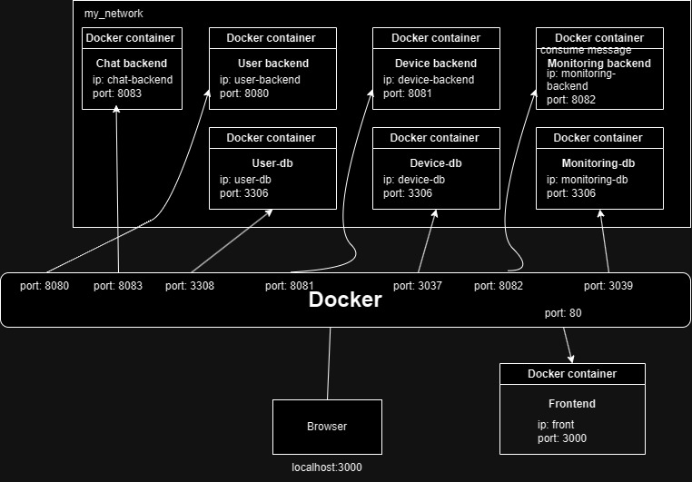

Documentatie Sisteme Distribuite 

 

Student: Sirbu Andrei  

Grupa: 30243 

Laborant: Liana Maria Toderean 

 

Cuprins 

 

Introducere……………………………………………………………. 

Implementare……………………………………………………….. 

Microservicii,Docker……………………………………………… 

Diagrame………………………………………………………………. 

Bibliografie……………………………………………………………. 

 

Introducere  

 

Se dezvoltă un sistem de gestionare a energiei compus dintr-un frontend și două microservicii special concepute pentru administrarea utilizatorilor și a dispozitivelor inteligente de măsurare a energiei asociate acestora. După procesul de autentificare, sistemul poate fi accesat de două tipuri de utilizatori: administrator (manager) și clienți. Pe site-ul administratorului, se pot efectua operațiuni CRUD (Create-Read-Update-Delete) asupra conturilor de utilizator (definite prin ID, nume, rol: admin/client), dispozitivelor inteligente de măsurare a energiei (definite prin ID, descriere, adresă, consum maxim de energie pe oră) și asupra corespondenței dintre utilizatori și dispozitive (fiecare utilizator poate deține unul sau mai multe dispozitive inteligente în locații diferite). 

  

Acronimul CRUD se referă la un set de operațiuni fundamentale în manipularea datelor în sistemele informatice. Mai jos sunt explicate fiecare dintre literele acestui acronim: 

  

- Create (C) - Creare: Procesul de adăugare a unor date sau înregistrări noi în sistem, precum adăugarea unui nou utilizator într-o bază de date. 

  

- Read (R) - Citire: Procesul de accesare și afișare a informațiilor stocate în sistem, cum ar fi citirea detaliilor unui utilizator sau afișarea unei liste de dispozitive. 

  

- Update (U) - Actualizare: Procesul de modificare sau actualizare a datelor deja existente în sistem, ca de exemplu schimbarea adresei unui utilizator sau actualizarea descrierii unui dispozitiv. 

  

- Delete (D) - Ștergere: Procesul de eliminare a datelor sau înregistrărilor din sistem, precum ștergerea unui utilizator sau a unei înregistrări de dispozitiv. 

 

Arhitectura 

 

Arhitectura Model-View-Controller (MVC) este un model de proiectare a software-ului care separă logicile de prezentare, logica de afaceri și gestionarea datelor în componente distincte, ceea ce face aplicațiile mai ușor de dezvoltat, întreținut și scalat. 

  

Iată o explicație mai detaliată a fiecărei componente: 

  

1. **Model (Modelul):** 

   - Reprezintă datele și logica de afaceri ale aplicației. 

   - Se ocupă de manipularea și gestionarea datelor, efectuarea de operațiuni și aplicarea regulilor de afaceri. 

   - Nu este conștient de interfața utilizatorului sau de modul în care datele sunt prezentate. 

  

2. **View (Vedere):** 

   - Este responsabilă pentru prezentarea datelor utilizatorului final. 

   - Primește informații din model și le afișează sub forma unei interfețe grafice sau a altor elemente vizuale. 

   - Nu conține logica de afaceri și nu interacționează direct cu datele. 

  

3. **Controller (Controlorul):** 

   - Gestionează interacțiunea dintre model și view. 

   - Primește input-ul utilizatorului și decide cum să proceseze acțiunile respective. 

   - Actualizează modelul în funcție de input-ul primit și actualizează view-ul pentru a reflecta schimbările. 

  

Prin separarea acestor componente, MVC oferă mai multe beneficii: 

  

- **Modularitate:** Fiecare componentă are o responsabilitate bine definită, ceea ce face mai ușor de înțeles și de dezvoltat fiecare parte a aplicației. 

  

- **Reutilizabilitate:** Datorită separării clare a componentelor, modelele și controlorii pot fi reutilizați în diferite părți ale aplicației sau în alte proiecte. 

  

- **Testabilitate:** Fiecare componentă poate fi testată independent pentru a asigura corectitudinea și performanța. De exemplu, logica de afaceri din model poate fi testată separat de interfața utilizatorului. 

  

- **Flexibilitate:** Modificările într-o componentă nu ar trebui să afecteze celelalte componente. De exemplu, schimbarea interfeței utilizatorului nu ar trebui să necesite modificări majore în model sau controlor. 

  

Cu toate acestea, trebuie avut grijă să se respecte principiile MVC pentru a obține beneficiile sale. Neglijarea separării corecte a responsabilităților poate duce la un cod dezordonat și greu de întreținut. 

  

Implementare 

  

	Fiecare microsevici are o baza de date(MySQL), pentru user s-a folosit baza de date user-db, respectiv pentru device s-a folosit device-dv. User-db are o tabela user in care se afla urmatoarele informatii;: id, username, password, user_role. Device-db va avea doua tabele, user si device, cu informatiile: user_id, respectiv: id, description, address, energy, user_id. Tabela user din baza de date este  folosita pentru sincronizarea dintre microserviciul user si microserviciul device. Cand se va trimite un request de inserare de user, respectiv de stergere de user se va sterge din baza de date user-db prima data si se va mai trimite inca un request sa se stearga id-ul userului din baza de date device-db, stocat in tabela user. Cand se va sterge un user, datorita legaturii straine dintre tabele, se vor sterge toate dispozitivele asociate utilizatorului respectiv. Cand se va adauga un device este obligatoriu sa se introduca un user_id existent in tabela user din baza de date device-db. 

 

Microservicii 

 

Microserviciile sunt o arhitectură de dezvoltare software care constă în împărțirea unei aplicații complexe în componente mai mici și independente, cunoscute sub numele de microservicii. Fiecare microserviciu reprezintă o entitate autonomă care îndeplinește o funcționalitate specifică a aplicației. Aceste microservicii comunică între ele printr-un protocol bine definit, cum ar fi HTTP sau mesageria asincronă. 

  

Avantajele utilizării microserviciilor includ: 

  

1. **Scalabilitate și Performanță:** Datorită naturii lor independente, microserviciile pot fi scalate individual în funcție de nevoile specifice ale fiecăruia. Acest lucru permite optimizarea performanței și gestionarea eficientă a resurselor. 

  

2. **Dezvoltare și Mentenanță Ușoară:** Echipelor le este mai ușor să lucreze independent asupra microserviciilor, concentrându-se pe dezvoltarea și îmbunătățirea funcționalităților specifice. Acest lucru duce la cicluri de dezvoltare mai rapide și actualizări mai frecvente. 

  

3. **Rezistența la Eșec:** Dacă un microserviciu experimentează o defecțiune, celelalte microservicii pot continua să funcționeze. Aceasta sporește rezistența sistemului la eșecuri și minimizează impactul negativ asupra întregii aplicații. 

  

4. **Tehnologii Diferite:** Fiecare microserviciu poate fi dezvoltat folosind tehnologii diferite, ceea ce permite echipei să utilizeze cele mai potrivite instrumente pentru sarcina lor specifică. 

  

Pe de altă parte, există și dezavantaje asociate cu utilizarea microserviciilor: 

  

1. **Complexitatea Managementului:** Coordonarea și gestionarea unui număr mare de microservicii poate fi dificilă. Este necesară o infrastructură și unelte adecvate pentru monitorizarea, gestionarea și orchestrarea acestora. 

  

2. **Comunicare și Latență:** Comunicarea între microservicii poate introduce un nivel suplimentar de latență în aplicație, mai ales dacă aceasta implică apeluri de rețea. 

  

3. **Consistența Datelor:** Păstrarea consistenței datelor între microservicii poate fi o provocare, mai ales în scenariile în care este necesar să se actualizeze date în mai multe locuri simultan. 

  

4. **Complexitatea Testării și Depanării:** Testarea și depanarea unei aplicații bazate pe microservicii poate fi mai complexă decât în cazul unei aplicații monolitice, din cauza dependențelor și a complexității comunicării între servicii. 

  

În concluzie, microserviciile oferă flexibilitate și scalabilitate, dar impun și provocări de gestionare și coordonare. Decizia de a utiliza microservicii trebuie să țină cont de specificul proiectului și de capacitățile echipei de dezvoltare. 

 

Docker 

 

Crearea imaginilor se face utilizand comenzile: 

	-docker build –t user-backend . 

	-docker build –t device-backend . 

	-docker build –t image-backend . 

 

Comanda `docker-compose up --build -d` este folosită pentru a construi și rula containerele specificate în fișierul `docker-compose.yml` în mod detaliat. Iată ce fac fiecare parte a comenzii: 

  

- `docker-compose up`: Această parte a comenzii rulează containerele specificate în fișierul `docker-compose.yml`. Dacă containerele nu există, Docker va încerca să le creeze. 

  

- `--build`: Această opțiune specifică ca Docker să refacă imaginile Docker ale serviciilor din fișierul `docker-compose.yml`. Acest lucru este util atunci când s-au făcut modificări la codul sursă sau configurările serviciilor. 

  

- `-d`: Această opțiune pornește containerele în modul detach (adică în fundal), astfel încât să poți continua să folosești terminalul în timp ce containerele rulează. 

# CSVReader Documentation

## Overview

The `CSVReader` class is a Java program designed to read sensor data from a CSV file, convert it into a JSON format, and then publish it to a RabbitMQ message queue. This documentation provides an overview of the package and explains how to use the `CSVReader` class.

## Package Information

- **Package Name:** org.example
- **Main Class:** CSVReader

## Dependencies

- **RabbitMQ Java Client Library:** This package relies on the RabbitMQ Java client library to establish a connection to a RabbitMQ server and publish messages to a queue.

## Usage

### Prerequisites

Before using the `CSVReader` class, ensure the following prerequisites are met:

1. **RabbitMQ Server:** A running RabbitMQ server is required to establish a connection and publish messages. The RabbitMQ server URI should be configured in the `setUri` method of the `ConnectionFactory` instance.

2. **CSV File:** The program expects a CSV file named "sensor.csv" to be present in the same directory as the program. This file should contain numeric values representing sensor measurements.

# MonitoringService Class Documentation

The `MonitoringService` class is a crucial component of the monitoring microservice, responsible for handling incoming sensor measurements, processing data, and notifying users through WebSocket communication. Below is a detailed documentation of the key functionalities and methods within this class.

## Properties

- `measurementsMap`: A map that stores measurements for each device identified by a unique UUID.
- `messagingTemplate`: An instance of `SimpMessagingTemplate` used for sending messages to WebSocket destinations.
- `monitoringRepo`: An instance of the `MonitoringRepo` class, which provides data access methods for interacting with the database.

## Constructor

### `public MonitoringService(MonitoringRepo monitoringRepo)`

- Initializes the `MonitoringService` with a provided instance of `MonitoringRepo`.
- Assigns the provided `monitoringRepo` to the local property.

## Methods

### `public void receiveMessage(String message) throws JsonProcessingException`

- Listens to the "measurements" RabbitMQ queue for incoming messages.
- Deserializes the received JSON message to extract measurement information such as value, timestamp, and device ID.
- Updates the `measurementsMap` with the latest measurement value for the corresponding device.
- Saves the measurement information to the database using the `MonitoringRepo`.
- Checks if the measurement exceeds the maximum energy consumption limit and sends a notification to the user via WebSocket.
- Calculates and sends the median value of the last six measurements to the WebSocket topic "/topic/monitoring/".

### `private double calculateMedian(List<Double> values, UUID deviceID)`

- Calculates the median of the first six values in the provided list.
- If there are fewer than six values, a default value of 0.0 is returned.
- Removes the first six values from the original list and updates the `measurementsMap`.
- Returns the calculated median value.

### `private void notifyUI(String topic, UUID userID, String message)`

- Sends a message to the specified WebSocket destination.
- The destination is constructed by combining the `topic` and the `userID`.
- Uses the `messagingTemplate` to convert and send the message to the WebSocket destination.

This `MonitoringService` class plays a crucial role in processing real-time sensor data, storing information in the database, and notifying users of relevant events through WebSocket communication.

# MaxConsumptionService Class Documentation

The `MaxConsumptionService` class is an essential component of the monitoring microservice, responsible for handling messages related to maximum energy consumption values. This class allows users to insert or delete maximum consumption records based on the received messages. Below is a detailed documentation of the key functionalities and methods within this class.

## Properties

- `maxConsumptionRepo`: An instance of the `MaxConsumptionRepo` class, which provides data access methods for interacting with the database.

## Constructor

### `public MaxConsumptionService(MaxConsumptionRepo maxConsumptionRepo)`

- Initializes the `MaxConsumptionService` with a provided instance of `MaxConsumptionRepo`.
- Assigns the provided `maxConsumptionRepo` to the local property.

## Methods

### `@Transactional @RabbitListener(queues = "consumption") public void receiveMessage(String message) throws JsonProcessingException`

- Listens to the "consumption" RabbitMQ queue for incoming messages related to maximum energy consumption.
- Deserializes the received JSON message to extract information such as the operation type, device ID, energy value, and user ID.
- Performs the corresponding database operation based on the operation type:
  - **DELETE**: Deletes the maximum consumption record with the specified device ID.
  - **INSERT**: Inserts a new maximum consumption record with the provided device ID, energy value, and user ID.
- Prints a message to the console if the operation type is not recognized.

This `MaxConsumptionService` class is crucial for managing maximum energy consumption records, allowing users to dynamically update these records based on incoming messages.

# WebSocket Configuration

The `WebSocketConfig` class is a part of the `com.example.monitoring.websocket` package and is responsible for configuring WebSocket communication in a Spring Boot application. This configuration is commonly used for enabling WebSocket support in combination with the Spring framework and can be particularly useful for real-time communication in web applications.

## Configuration Details

### `@Configuration` Annotation

This annotation indicates that the class contains bean definitions that should be processed by the Spring container.

### `@EnableWebSocketMessageBroker` Annotation

This annotation enables WebSocket message handling, allowing the configuration of a message broker to be used for routing messages between clients.

### `WebSocketMessageBrokerConfigurer` Interface

This interface provides methods to configure WebSocket message handling.

#### `configureMessageBroker` Method

This method is used to configure the message broker. In this case, it enables a simple in-memory message broker to carry messages back to the client with destination prefixes "/topic" and "/app."

- `config.enableSimpleBroker("/topic")`: Enables a simple message broker with the specified destination prefix.
- `config.setApplicationDestinationPrefixes("/app")`: Defines the prefix for messages that are bound for methods annotated with `@MessageMapping`.

#### `registerStompEndpoints` Method

This method is used to register STOMP (Simple Text Oriented Messaging Protocol) endpoints, allowing clients to connect to the WebSocket.

- `registry.addEndpoint("/ws")`: Registers the "/ws" endpoint that clients can use to connect to the WebSocket.
- `.setAllowedOrigins("http://localhost:3000")`: Specifies the origins that are allowed to connect to this WebSocket. Replace "http://localhost:3000" with the origin of your React application.
- `.withSockJS()`: Enables SockJS fallback options for browsers that do not support WebSocket.

## Usage

1. Annotate your main application class with `@SpringBootApplication` to enable Spring Boot features.

2. Make sure to have the necessary dependencies, such as Spring Boot Starter Web and Spring Boot Starter WebSocket.

3. Create a `WebSocketConfig` bean by either placing it in the same package as your main class or using the `@ComponentScan` annotation to scan the package.

4. Now, your Spring Boot application is configured to support WebSocket communication with the specified endpoint and message broker.

# Diagrama de deploy

